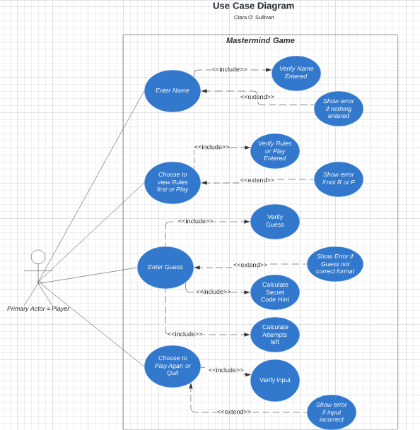
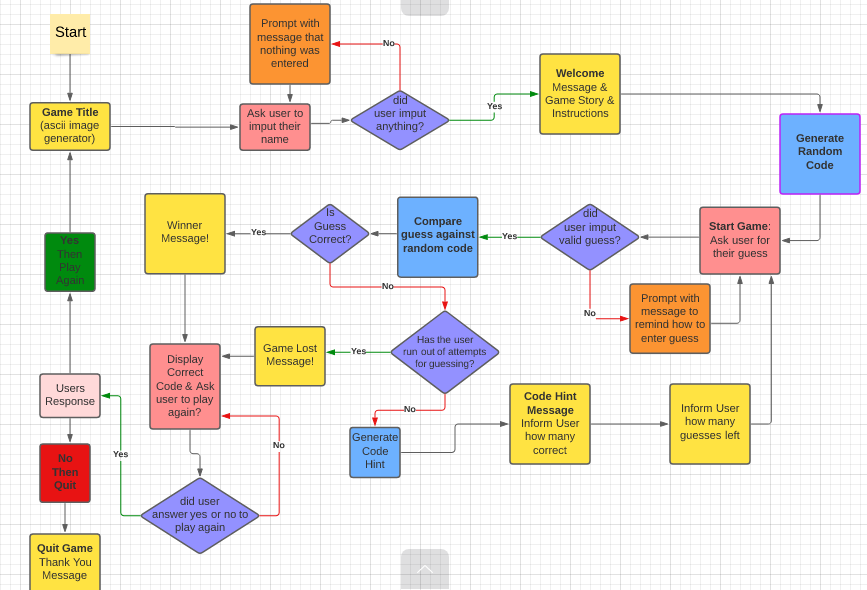

# **Mastermind**

Mastermind is a Python terminal game that runs on Heroku.

View the live project [Here](https://mastermind-code-breaker.herokuapp.com)

Users play to crack the secret code randomly chosen by the computer.  Users are given hints generated by the computer after every attempt.

## How To Play

## User Experience (UX)

### User Stories
A user wants to:

### User Experience Research

### User Experience in this Game
This game takes these key reseach pieces and the users stories mentioned above into consideration to create a positive UX.  The users experience is discussed in more detail below with examples in the Design & Features Sections.

## Features

### Features Left to Implement

## Design

### Data Model

**UML - Use Case Diagram**

Unified Modelling Language (UML) was used to visualize the various features of the game. 

* A Use Case Diagram was drafted to capture the games functionaity and relationships with the user.

* The Matermind Game is the system represented by the rectangle below.  The external object is the Primary Actor.  In this game it will be the Player that initiates the use of the system.

* The Use Case in the diagram below are represented in circles and these are the actions that will initiate different tasks within the game.

* The relationship the Player has with the system is represented with a solid line.  The two other relationships are include relationships (executed each time) and extend relationships (executed sometimes), which are represented by a dashed line.

**Classes**

Throughout this project, I have opted to use Object Oriented Programming. From the Use Case Diagram the Classes were created.  The game consists of two classes, the Player & the CodeGenorator.  Both of these classes have asscociated methods.  These classes can be expanded on in future development.  They are stored in separate files to allow for separating the code into parts that hold related data and functionality.  This will allow any future expansion and development of this project to have a clear structure and also for any code re-use and sharing as well as maintenance.

**Flow Control**

To design the order in which individual statements, instructions or function calls were executed or evaluated a flow chart was used for the control flow.  Here, the flow of the game was laid out and structured to aid in the design of the control flow statements such as if-elif-else statements, while loops and for loops.  This also allowed the design of the user input validation loops to be visually clear before the code was written.

### Asthetic Design

**Fonts**
[Pyfiglet](https://www.geeksforgeeks.org/python-ascii-art-using-pyfiglet-module/#:~:text=pyfiglet%20takes%20ASCII%20text%20and,pyfiglet%20module%20%3A%20pip%20install%20pyfiglet) was installed and import pyfiglet was used to generate ascii art for the game.  Pyfiglet was added to requirements.txt then for deployment.

The ascii art was chosen for readability for the user from [Figlet.org](http://www.figlet.org/)

**Fonts used were:**

*   Standard Font - for clarity & Line Spacing.  Used on Title & Winner Message

*   Digital Font - for letters having a locked-in effect.  Used on sub-title and game lost message to depict code not broken or cracked.

**Colour**
To change the font colour and background colour of some words [Colorama](https://pypi.org/project/colorama/) was imported.  Colorama was added to requirements.txt then for deployment.  

A mix of yellow, green, blue and red was used to keep the game play interesting and as a visual que to user for certain feedback.

## Libraries & Technology Used

**Built in Python Libraries**

*   os

The os library was imported to create a function to utilise the os.system to clear the terminal.  This supports a positive user experience on game replay by clearing the previous game play and making the screen clearer and more structured.

*   random

The random library was imported to access the built in method of generating a random number selection using the ranint() method.  This then is used to generate a random sequence of 4 numbers from a range of 1 – 10 for the secret code the user has to crack.

**Other**
* [Colorama](https://pypi.org/project/colorama/) for adding colour to fonts.

*   [Pyfiglet](https://www.geeksforgeeks.org/python-ascii-art-using-pyfiglet-module/#:~:text=pyfiglet%20takes%20ASCII%20text%20and,pyfiglet%20module%20%3A%20pip%20install%20pyfiglet) for adding ascii art.

*   [LucidCharts](https://www.lucidchart.com/) was used to create the UML Case Diagram, Class Diagram and the Flowchart.

## Testing

### Interesting Issues & Bugs Found
### Validator Testing

## Deployment

## Credits

## Acknowledgements

