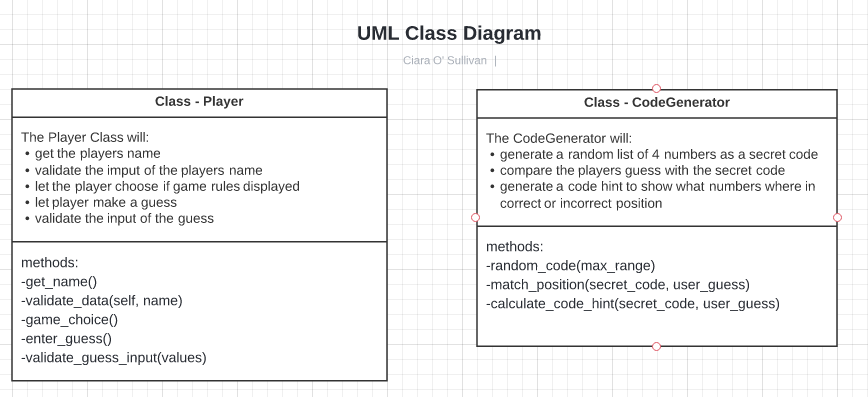

# **Mastermind**

Mastermind - Code-Breaker, is a Python terminal game that runs on Heroku.

View the live project [Here](https://mastermind-code-breaker.herokuapp.com)

This game is based on the board game of [Mastermind]( https://en.wikipedia.org/wiki/Mastermind_(board_game)) from the 1970’s, which is actually based on an even older paper and pencil game called Bulls & Cows.

This game was chosen as it seems it would appeal to the target audience of adults seeking to play an online strategy game for a fun challenge and cognitive stimulation.

According to [Barrow Neurological Institute](https://www.barrowneuro.org/centers-programs/neurorehabilitation/resources/neuro-rehabilitation-apps-and-games/) The Mastermind board game can be used for planning, problem solving, and decision making.  Also, according to [Strom & Barolo (2011)](https://www.researchgate.net/publication/49785492_Using_the_Game_of_Mastermind_to_Teach_Practice_and_Discuss_Scientific_Reasoning_Skills) the Mastermind board game has been adapted for applications in fields such as Maths, Computing and Psychology and used as a tool for teaching logic.  They argue that it can also be utilised to teach topics relevant to the Life Sciences such as experimental design, hypothesis testing, interpreting results and use of controls.

## How To Play

In this game Mastermind – Code Breaker, users play to crack the secret code randomly chosen by the computer.  Users are given hints generated by the computer after every attempt to try to logically deduce what the correct secret code is.  

*   The secret code is 4 numbers between 1 - 10 and any of these numbers may be repeated.

* The player has 10 attempts to guess the sceret code.  The correct guess must be all 4 correct numbers in the correct order.

* After every attempt (unless successful) the player is given a code hint.  Every GREEN represents how many numbers were correct and in the correct position.  Every ORANGE represents how many numbers were correct but in the incorrect position.  

* The code hint og GREENs and ORANGEs are do not match the order of the players numbers in their guess.

>
>**For example:**
>
>       secret code is 1, 2, 3, 4
>
>       guess is: 1, 3, 5, 4
>
>       code hint will be: GREEN GREEN ORANGE
>
>       This represent 1 & 4 as two GREENs and 3 as ORANGE

* If none of the 4 numbers are correct, the player will recieve feedback to state this, otherwise they will not be told which numbers are incorrect.

## User Experience (UX)

### User Stories

Target Audience – Adults who want to play an online command line interface strategy game for a fun challenge and cognitive stimulation.

As a User I want to:
* play the game clearly across different devices
* understand how to play the game
* play a game that is not timed
* know how many attempts I have left
* know when I have entered something in an incorrect format and understand why
* have fun and be challenged
* have the choice to easily play again or quit

### User Experience in this Game
This game takes the users stories mentioned above into consideration to create a positive UX.  The users experience is discussed in more detail below with examples in the Design & Features Sections.

## Features

**Title Section:**

* [Pyfiglet](https://www.geeksforgeeks.org/python-ascii-art-using-pyfiglet-module/#:~:text=pyfiglet%20takes%20ASCII%20text%20and,pyfiglet%20module%20%3A%20pip%20install%20pyfiglet) was installed and import pyfiglet was used to generate ascii art for the title and subtitle of the game.

* Standard Font was used for the title as it is large and has nice spacing and clarity of letters.  This was to give the user clarity of what the game is called.  It was centered to give a nice clean layout too.

* For the subtitle the font used was digital.  Although not as clear as the standard fornt, it was used for fun and uniquness to give the user the feeling of the letters being 'locked-in' to compliment the theme of the game.

* The authours name was centered too to separate it from the game play area and coloured using Coolor to help it stand out and make the first part of the game bright for the user.

* A friendly message to the user to enter their name is seen first. This alerst the user to how to start playing the game.

    

* However, if the user presses enter without inputting a name an error will appear.  This game will accept any characters or numbers for a name as the user may wish to use a nickname or a fun made up name.  However, if nothing at all is entered then the user is shown a message in red to highlight to them that nothing was entered and instuctions on what to do and to try enter a name again.

    

**Name Input Section:**

* After the user is asked to input their name, they are greeted with a Welcome message with their name returned in colour,  This was to add some fun personalisation and interactivity for the user.

* The user is then asked if they would like to Play straight away or view the Rules of the game.  Both these words are highlighted in different colours to show the 2 options clearly to the user.  The purpose of this was in case the user is returning they may not wish to have the screen cluttered with the rules of how to play and would just like to start straight away.

    

* However, if the user presses anything other than inputting R or P an error will appear.  This game will accept capital R or small r and capital P or small p because the users input is changed to lowercase when inputted by using the .lower method.  The error message is in red to highlight to them that what was entered was incorrect and instuctions on what to do and to try enter R or P again.

    

**Rules Section:**

* If the user decides to view the rules section the How to Play title appears.  Instructions are made simple and easy to read.  The use of spaces and colour were deemed important in this section to separate between the different sections and highight some important words or phrases for the user to easily read and understand.

    

* At the end of the How to Play section the game begins the same as if the users had chosen to skip the Rules and go straight to play.

* The amount of guesses left is shown in red and the user is invited to make their first guess.

**Player Guess Input**

*  When the user enters their 4 number guess their guess is printed back to them as a list with the code hint underneath.  This was decided on as it gives clear feedback to the user what they entered and positions it on top of the code hint to keep it structured and clear what the guess and hints are.

*   The code hint may be a mix of GREEN and ORANGE words with background colour matching.  Green was chosen as the colour that denotes correct.  So GREEN code hint represents correct number in correct position.  Orange was chosen as the colour denotes not quite correct but not incorrect.  So ORANGE code hint represents correct number but in incorrect position.

*   The player is not informed of which number/s are incorrect completely as this would make the game easier.

*   Only if none of the 4 numbers are enetered correctly, then the player is informed of this by a message in red lettering.  This is to prevent an empty code hint appearing, whcih may cause the player to think the game is not working correctly.

*   Also, after the code hint the users is informed each time, how many attemps they have left to guess.  This is highlight in red to make it clear and stand out.

    

**User Guess Input Validation & Feedback**

The game will accept the users guess in the form of 4 numbers between 1-10 separated by a space.

*   If the user happens to make an extra space at the begining or end of their guess, this is handeled by using the .strip() method.  This will automatically strip the white spaces from the begining and end of the input without raising the alarm to the user that their input was incorrect.

*   If the user enters a number below 1 or above 10 they will be notified of their error and what to do to try again.

* If the user enters words or special characters or any extra spaces between numbers or even just no input at all, they will be given feedback and a chance to enter again.

    

**Game Lost**

* If the player runs out of guesses and still has not revealed the secret code they will be informed and shown the secret code they were trying to guess.

* There is also the Code Not Cracked title in the digital font to add a bit of extra fun and show the game is over.

    

**Game Won**

* If the user guesses correctly before their 10 attemps is up a Winner message displays.  The standard ascii fornt from pyfiglet is used to display this message as it is big and compliments the title at the start of the game.

    

**Play Again**
* In both the Game Lost and Game Winner scenarios the user is given the ption to play again.  Here user nput is validated for a Y or N.  Both capital and lower case are accepted and if there is an error the user is alerted to this and given the option again.

    

* if the user decides not to play again then a message saying goodbye and thanking them for playing is given.  The game is then quit by using the exit() method.

* If the user decides to play again then they are taken back to the start.  Incase the player needs to view the rules again or there is another person wanting to play next, the start of the game will allow for any of these scenarios by asking for name and giving the choice to view the rules again.

* Import os was used to create a function using the os.system("clear") method to clear the screen on play gain for the user.  This helps to ensure the screen is cleared of the old game making it easier to read and better structure for the user.  

* A message saying You Chose Yes! Let's Play is printed to vlidate the users response and showing the start of a new game.

### Future Development & Features Left to Implement

* This game is a one-player versus the computer.  In style wth the old Mastermind Board Game version this game could be made into a 2 player game.  As with the Board Game version the first player makes the code for the second player to guess.  After that player has won or lost, it is then their turn to create the code for the other player to now attempt to guess.  This could be easily implimented with the code already laid down.  Minor changes to the CodeGenerator clas could be implimented to allow for another player to enter the secret code instead of the computer randomly generating one.  The players input would need to be validated that it is in the correct order.

* This game does not give the option yet to show high scores.  One approach could be implimenting Google Spreadsheets to store the amount of attempts it took for each name entered.

* Other versions of the game could be implimented such as using colours for the scret code as in the Board Game style or using letters that correspond to words such as a Hangman or Wordle style game.

* To make this game harder for different levels more numbers could be added to the secret code or less attempts given.  To make the game easier the player could be told which numbers are incorrect in the code hint by using the RED hint.

* This game was designed and created for the target audience of adults.  However, during testing some children aged 5 - 9 were given the opportunity to test and play.  With some minor changes to the instructions making them more easily interpreted for children of this age group, this game could be modified to reach a wider aged target audience.

### Data Model Design

**UML - Use Case Diagram**

Unified Modelling Language (UML) was used to visualize the various features of the game. 

* A Use Case Diagram was drafted to capture the games functionaity and relationships with the user.

* The Matermind Game is the system represented by the rectangle below.  The external object is the Primary Actor.  In this game it will be the Player that initiates the use of the system.

* The Use Case in the diagram below are represented in circles and these are the actions that will initiate different tasks within the game.

* The relationship the Player has with the system is represented with a solid line.  The two other relationships are include relationships (executed each time) and extend relationships (executed sometimes), which are represented by a dashed line.

**Classes**

Throughout this project, I have opted to use Object Oriented Programming. From the Use Case Diagram the Classes were created.  The game consists of two classes, the Player & the CodeGenerator.  Both of these classes have asscociated methods.  The class diagram below was used to decide what each class does and then design the methods each class should have.

The classes and their asscociated methods are stored in separate files to allow for separating the code into parts that hold related data and functionality.  This will allow any future expansion and development of this project to have a clear structure and also for any code re-use and sharing as well as maintenance.

**Flow Control**

To design the order in which individual statements, instructions or function calls were executed or evaluated a flow chart was used for the control flow.  Here, the flow of the game was laid out and structured to aid in the design of the control flow statements such as if-elif-else statements, while loops and for loops.  This also allowed the design of the user input validation checks to be visually clear before the code was written.

### Aesthetic Design

**Fonts**
[Pyfiglet](https://www.geeksforgeeks.org/python-ascii-art-using-pyfiglet-module/#:~:text=pyfiglet%20takes%20ASCII%20text%20and,pyfiglet%20module%20%3A%20pip%20install%20pyfiglet) was installed and import pyfiglet was used to generate ascii art for the game.  Pyfiglet was added to requirements.txt then for deployment to Heroku.

The ascii art was chosen for readability for the user from [Figlet.org](http://www.figlet.org/)

**Fonts used were:**

*   Standard Font - for clarity & Line Spacing.  Used on Title & Winner Message

*   Digital Font - for letters having a locked-in effect.  Used on sub-title and game lost message to depict code not broken or code not cracked.  This is a little hard to read but the fun point of using this font is exactly that.  The letters are presented locked in a grid and to read them is on par with trying to figure out and break a code, which fits nicely with the theme of the game.  The text in this font is not detrimental to understanding the game or instructions, it is purely for fun and decoration so it should not matter if it is not read.

**Colour**
To change the font colour and background colour of some words [Colorama](https://pypi.org/project/colorama/) was imported.  Colorama was added to requirements.txt then for deployment.  

A mix of yellow, green, blue and red was used to keep the game play interesting and as a visual que to user for certain feedback.

## Libraries & Technology Used

**Built in Python Libraries**

*   os

The os library was imported to create a function to utilise the os.system to clear the terminal.  This supports a positive user experience on game replay by clearing the previous game play and making the screen clearer and more structured.

*   random

The random library was imported to access the built in method of generating a random number selection using the ranint() method.  This then is used to generate a random sequence of 4 numbers from a range of 1 – 10 for the secret code the user has to crack.

**Other**
* [Colorama](https://pypi.org/project/colorama/) for adding colour to fonts.

*   [Pyfiglet](https://www.geeksforgeeks.org/python-ascii-art-using-pyfiglet-module/#:~:text=pyfiglet%20takes%20ASCII%20text%20and,pyfiglet%20module%20%3A%20pip%20install%20pyfiglet) for adding ascii art.

*   [LucidCharts](https://www.lucidchart.com/) was used to create the UML Case Diagram, Class Diagram and the Flowchart.

*   Microsoft Photos to edit, crop and save images of charts and diagrams

## Testing

### Interesting Issues & Bugs Found

### Validator Testing

## Deployment

## Credits

## Acknowledgements

